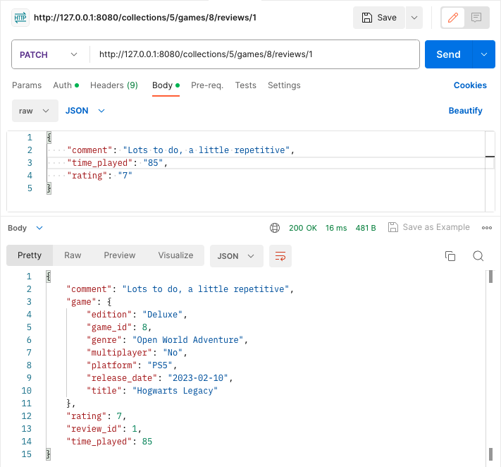
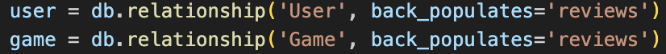

# The Games Collection - API Webserver Project
___

## Links 

[GitHub Link](https://github.com/kelshardy/T2A2)

[Trello Board Link](https://trello.com/b/8j2oJ2o3/api-webserver-project)

___
## R1. Identification of the problem you are trying to solve by building this particular app. / R2. Why is it a problem that needs solving?

For those who have an intense (or just solid) physical games collection at home, I bring you this! This project is to support those who need help in keeping a track record of what is on the shelf and doesn't need purchasing again. It is also designed to make life easier. 

How? Say you have friends over, it's game night. You want to put on a multiplayer game everyone can enjoy. Your friends are getting bored watching you flick through your collection one by one. If only there was a way to sort out your collection into a list and find something that is not only multiplayer, but suited to their game preferences... 

Let this application do the heavy lifting for you.

Ultimately, the aim of this app is to find a solution for game management. With this project a user can create an account, start a collection and then proceed to add games they own into this database to help track and manage their property.
This application keeps everything in check, such as having the ability to check what games are stored in the app to avoid making that second (or third) purchase, helping keep record of where you're at (having an exact figure for your total games could really impress your friends) or even the option to be able to sort games into categories for an easier process of elimination.
___
## R3. Why have you chosen this database system. What are the drawbacks compared to others?
___
Postgres has been the utilized database management system for this application. This particular DBMS was chosen because it is one of the most popular relational database systems that has the flexibility for data entry customizations as well as being capable of handling large data inputs and having ACID compliance. As JSON has been frequently used in this code, it is important that the database system is capable of handling complex queries, especially with JSON. Postgres has been helped implement CRUD operations with JSON, making it incredibly beneficial for the creation of this application.
In terms of drawbacks with Postgres, it does seem to perform slower than other database management systems or to perform more efficiently requires heavier resourcing.
Overall, this application was suited to Postgres for general development and the capabilities were within the needs of the application.
___
## R4. Identify and discuss the key functionalities and benefits of an ORM
___
Object Relational Mapping is an operating component that joins the objects within programming languages (for this project - Python classes/models) to the relative database (PostgresQL is the utilized DBMS) which allows for simple establishment of relationships and effiency in SQL operations.
There are many benefits to utlizing ORM tools, these include:
- Faster code development as ORMs minimize the need for excess coding due to the ability to convert SQL Queries.
- The maintenance of DRY coding, as models are established in one place, this instance can then be used without the need to repeat attributes within the application.
- Makes for easier validation and sanitation.
- From a developer's perspective, a deeper knowledge into the database management system would not need to be so thorough as ORMs handle the work.
___
## R5. Document all endpoints for your API
___
The project has multiple API endpoints.
This application has been made to be able to conduct multiple operations for the ability to store game information and reviews within user collections.
These are brought to fruition within the different controllers of the code.

The first being the ```auth_controller.py``` which allows a user to be created and registered, as well as allowing access to be able to add, delete and update information within created collections.

```python
/auth/register
```
- This method and route creates and establishes a user for the login process.


```python
/auth/login
```
- If correctly signed in with a registered email and password, this route will allow the user access to a generated Token.

___

The next set of endpoints is for the ```collection_controller.py``` file, which handles the CRUD operations for the Collection model.

```python
GET collections/
```
- This route provides access to view all collections stored within the user's account.


```python
GET collections/<int:collection_id>
```
- This method and route allow for the user to see specified collections by adding the collection_id number to the end of the URL.


```python
POST collections/
```
- This method allows for a verified user to create a collection to begin storing games in its registry.


```python
DELETE collections/<int:collection_id>
```
- This method allows for the user to delete a specific collection with a collection_id number.


```python
PUT or PATCH collections/<int:collection_id>
```
- This method gives the user access to make adjustments within a stored record of the collection model.

___
The next API endpoints are collection from the ```game_controller.py``` which represents the capabilities of the controller in regards to the storing of game information.

```python
GET games/
```
- This method allows access to a list of all games that have been added and stored to a certain collection.


```python
GET games/<int:game_id>
```
- This method and route directs the user to a particular game identified with the game_id specified in the URL.


```python
POST games/
```
- This method and route gives the user the ability to add a game, along with its information into the database. This creates a new entry into the Games table.


```python
DELETE games/<int:game_id>
```
- With a particular game_id as an end input, and with access via a login token the user is capable of deleting game entries from the database.


```python
PUT or PATCH games/<int:game_id>
```
- This method allows for the user to make adjustments to pre-existing content by specifying the game_id and then entering the updated information.

___
The last of the endpoints come from the ```review_controller.py```, to allow a user to create, delete, update and display reviews for games that exist within their current collections.

```python
GET reviews/
```
- The user is able to list the reviews for games stored within the collections by entering this route and choosing the GET ,method.


```python
POST reviews/
```
- This method and route allows the user to generate their own reviews to games stored within their collection. 


```python
DELETE reviews/<int:review_id>
```
- With the review_id entered into the URL, the user can then choose to delete reviews.


```python
PUT or PATCH reviews/<int:review_id>
```
- With either PUT or PATCH methods and the review_id number, the user can make adjustments to pre-existing reviews if they need amending.

___
## R6. An ERD for your app
___

This diagram shows the Models that are featured in the application, as well as the relationships that join them. 

User to Collection - is a one to one or many relationship, as user would only create a login to also create a collection.

Collection to Game - is a one to one or many relationship as a collection needs one or many games to be a collection.

Game to Review - is a one to zero or many relationship as a there has to be a game for a review to be added, or there doesn't need to be a review on a game at all.

Review to User - is a zero or many to one relationship as there needs to be a user to create none or many reviews.
___
## R7. Detail any third party services that your app will use
___
This application has been built using Python with Flask for the framework of this project. Third Party Services being implemented in this application are:
- SQLAlchemy - the Object Relational Mapping tool within the project that has helped link databases with Python coding to establish the classes as Models within the databases.
- Flask-Marshmallow - this has been imported to establish schemas inside the application, creating identities with attributes and allowing for conditional validation within these schemas.
- Flask-JWT-Extended - for the creation of JWT Tokens as well as user verification and authentication, this helps limits access to information unless the user has been authorised to do so with a Bearer Token.
- Bcrypt - this has given the ability to hash user passwords, ensuring the application is more secure for users as it is harder for their information to be accessed by someone other then themselves.
- Psycopg2 - this driver has aided the relationship between Python and PostgresQL by comprehending SQL operations in order to implement and execute them.
___
## R8. Describe your projects models in terms of the relationships they have with each other
___

This application is made up of different relationships between these four models:

### User
- The User Model creates the user login to access a JWT Token to create collections in the database. This model has a relationship with the Collections model as a User is needed to create a collection and one User can have one or many collections. The User model also has a relationship to the Review model as a User is needed to create a review on a game.


### Collection
- The Collection Model is the entity that creates a home to bring all the game information into for the database. This model is linked to the User (as a User is needed for this model) and the Game model and games are listed and stored in this model.


### Game
- The Game Model is the table that takes record of all the game data for each game entered. This model has a relationship to the Collection model (this brings all the information into one place), while also having a relationship with the Review model, as reviews can only get conducted on games that have been entered into the database.


### Review
- The Review model allows the User to create a review on games entered in the database. This model has a relationship to the User, as a User is needed to create Reviews and a User can also create none or many reviews. The Review model also has a relationship with the Game model as a game is needed for there to be a review created. Therefore there needs to be a game, and the game can have zero or many reviews.



___
## R9. Discuss the database relations to be implemented in your application
___
The relations that are implemented in the database are developed within the different models of the application. 
The User model implements a one to one or many relationship with the Collection model. 

The User model then has a foreign key within the Collection entity as a Collection needs a User in order to be created. 

The Collection table is linked to the Game model and a one to one or many relationship as well. This is because a Collection is needed for there to be a Game added to the database, in turn, more than one Game can be added to a Collection, hence the 'or many' connection. 
This Game link also creates a Foreign Key in the Collection controllers for the Game entity as well. 

The relationship implemented between the Game and Review models is a one to zero or many relation as a Review cannot be created without a Game, or a Game is needed for there to be a Review. This implements a Foreign Key contained in the Review model for Games.

The link between a User and Review is a one to zero or many realtionship also, as there needs to be a User to create a Review, and also a User can create zero Reviews. This also encourages a second Foreign Key for User in the Review table.
___
## R10. Describe the way tasks are allocated and tracked in your project
___
This API Webserver Project been slowly building through the use of a Trello board to track and maintain tasks within the application, as well as documentation.

The Trello board has been divided into 5 sections to monitor the different tasks listed. These sections include: 
- To Do - This list has details the aspects of the project that are needed to fulfil the assignment overall. Some jobs within this category have contained dates as they have needed to be completed in certain timeframes, as well as some featuring their own checklists as they have required more tasks within themselves. 
For instance, Create Models has required 5 Models to be individually ticked off inside this particular element.

- Pending - As tasks are taken on, they make their way to the Pending section as they are worked on.

- Problems - This list has comprised on errors that has arisen in running and testing the code. As the errors have come up, they have been added to the Problems list, monitored and tested until a successful result has occurred. 

- Requirements - This part of the Trello board has been used to store the requirements of the rubric in relation to this particular project, both for coding and documentation.

- Done - This list has collected tasks as they have gradually been completed from the Pending list.

The tasks have been labelled in regards to their status. The following labels were created to assign to each element to maintain consistency and link back to their relative sections of the assignment:
- Create - mainly for coding elements.
- Documentation - For the planning of this assignment via README.
- Test - Tasks that need to be tested.
- Priority - For elements that have required urgent attention.
- Checklist - For items in the lists that have been made up of more than just a single task.
- Monitor - For parts of the Trello that have required consistent checking to ensure they work successfully.

Below are screenshots that have been taken throughout the Project for reference to task allocation, tracking and progression towards completion.


___ 
## Getting Started
___
To download and get started, click the green ```<>code``` button on the top right hand side of this page or click this link [here](https://github.com/kelshardy/T2A2/archive/refs/heads/main.zip) to download the zip file of this application instantly.

After opening this Flask application, execute PostgresQL in the terminal by prompting 

```psql```

A database for this application can be created in the command line using 

```CREATE DATABASE gamecol_db;``` 

and then connect to is using 

```\c gamecol_db;```

Once this has been completed, create a user for the database with 

```CREATE USER gamecol_dev;``` 

followed by 

```GRANT ALL PRIVILEGES ON DATABASE gamecol_db TO gamecol_dev;``` 

After this, the DBMS can be closed with 

```\q```

The next step in the terminal is to change directory into the src folder 

```cd src``` 

and create a virtual environment for the application to run all the dependencies. The command line 

```python3 -m venv .venv``` 

should create one which can then be activated with 

```source .venv/bin/activate```

Once this has been initiated, the next process would be to install the requirements for this application using

```pip install -r requirements.txt```

And env file may require the database_url and secret_key for this project, which are located in the docs folder under 'DATABASE_SECRETKEY' as a PNG file.
The tables for the database can be created using

```flask db create```

which should print 'Tables Created'. This can be followed by

```flask db seed```

which should print 'Tables Seeded'. After these two prompts, the application should be able to run with 

```flask run```

This API project can then run in Postman or Insomnia (Postman was used for the creation of this app) on this server

```http://127.0.0.1:8080```

Everything is ready to go!
